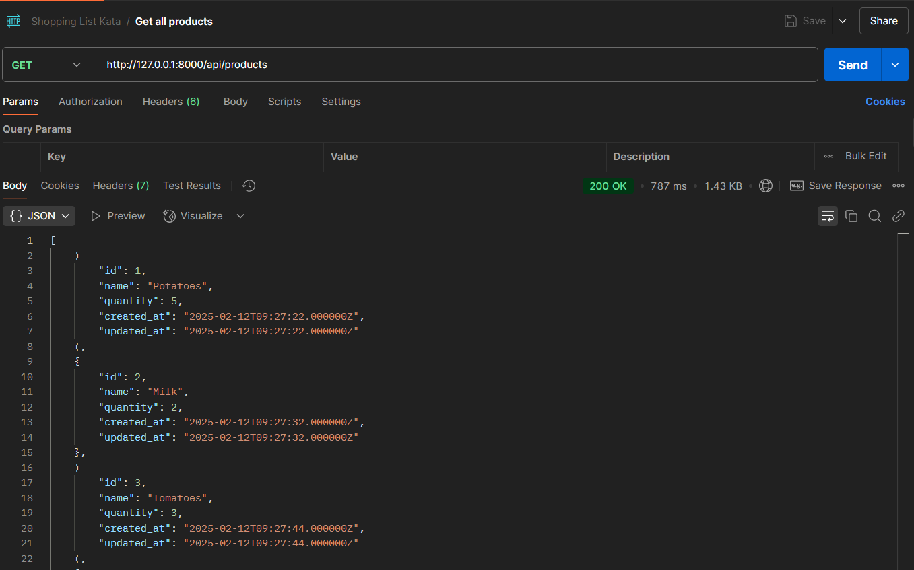
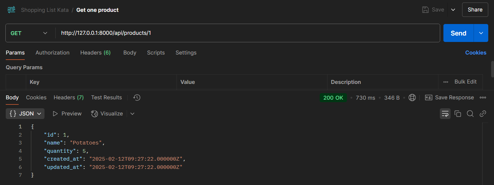
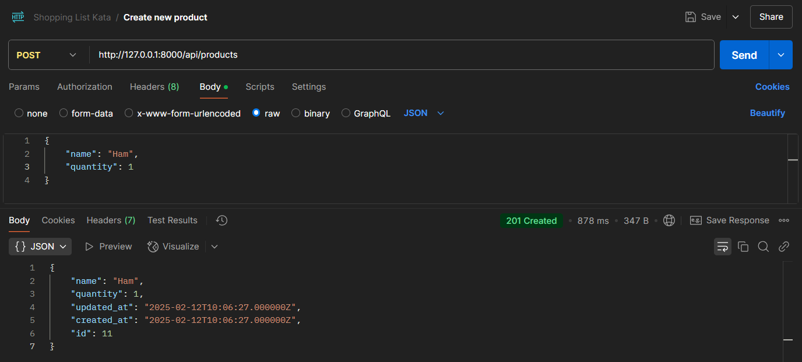
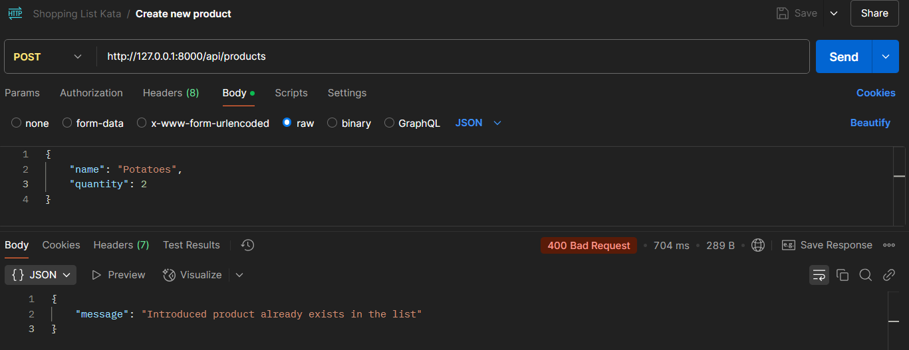
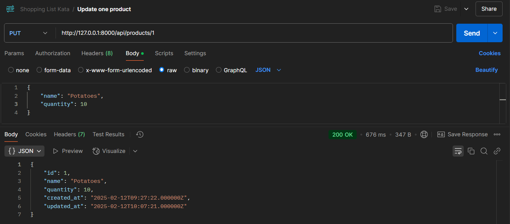
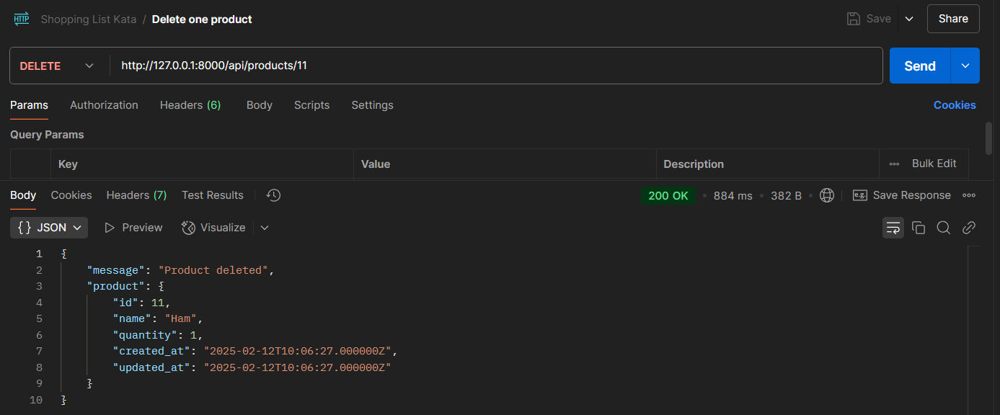
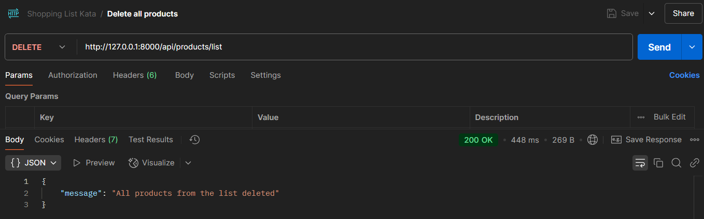
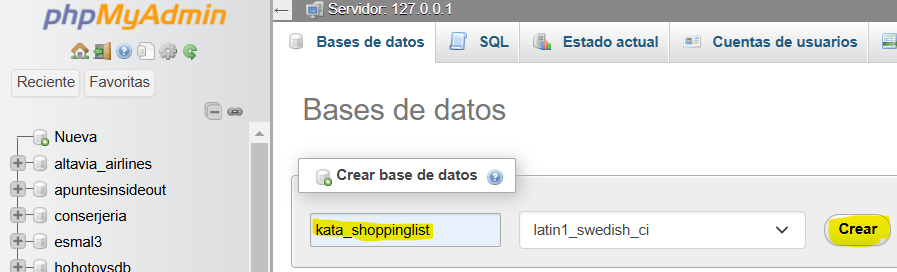
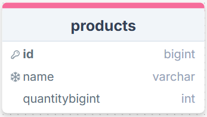
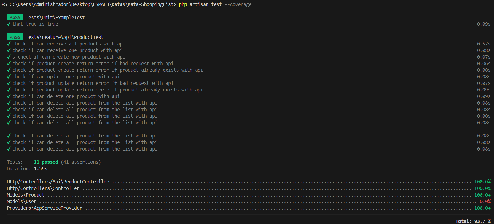

# KATA - Shopping List

>[!CAUTION]
>Please read all the points of the README in order to make good use of the project. Thank you.

## 💡 Description

This project consists of an application where you can see your shopping list. All the functionality of this project is developed to used it by API.

## 💼 Proyect guide

We Will see the functionality of this Project in Postman (or any other platform you prefer).

One of the requirements of this project is that the products can't be repeated. Let's see some examples of what we can do:


<p align="center"><em>Get all products request</em></p>


<p align="center"><em>Get one product request</em></p>


<p align="center"><em>Create a new product request</em></p>


<p align="center"><em>Try to create a product that already exists</em></p>


<p align="center"><em>Update one product request</em></p>


<p align="center"><em>Delete one product request</em></p>


<p align="center"><em>Delete all products request</em></p>

## ❓ Installation requierements

In order to run and try this project locally you will need:

1. XAMPP (or any other local server that supports PHP and MySQL)

2. Operating System terminal

3. Install Composer

4. Install NPM via Node.js

5. Xdebug (so you can see the tests coverage)

6. Postman (or any other platform to use the API, like *Insomnia*)

## 💻 Installation

1. Clone the repository:
```
    git clone https://github.com/ArianaMartinMartinez/Kata-ShoppingList.git
```

2. Install Composer:
```
    composer install
```

3. Install NPM:
```
    npm install
```

4. Create a '.env' file by taking the example '.env.example' file and modify the lines:
    - DB_CONNECTION=mysql
    - DB_DATABASE=kata_shoppinglist

5. Create a database in MySQL with no tables (I use *phpMyAdmin*)


6. Generate all the tables and fake values:
```
    php artisan migrate:fresh --seed
```

7. Run NPM:
```
    npm run dev
```

8. Run Laravel (in other terminal):
```
    php artisan serve
```

This will generate an url that will lead you to the web similar to this one:
```
    http://127.0.0.1:8000/
```

## 📚 Database diagram

This is the database diagram for this project. We only have one table ***Products*** where we will find our shopping list.



## 🔍 API Endpoints

- GET (read all products)
```
    http://127.0.0.1:8000/api/products
```

- GET BY ID (read one product selected by ID)
```
    http://127.0.0.1:8000/api/products/{id}
```

- POST (insert a new product)
```
    http://127.0.0.1:8000/api/products
```

- PUT (update a product selected by ID)
```
    http://127.0.0.1:8000/api/products/{id}
```

- DELETE PRODUCT (delete a product selected by ID)
```
    http://127.0.0.1:8000/api/products/{id}
```

- DELETE LIST (delete all the products on the list)
```
    http://127.0.0.1:8000/api/products/list
```

## 👾 Tests

This project has a **93.7%** of test coverage.

You can try the tests and see the coverage in the terminal using:
```
   php artisan test --coverage
```



>[!TIP]
>You can also see the coverage in a web browser using:
>```
>   php artisan test --coverage-html=coverage-report
>```

## 🛠️ Technologies and Tools

<a href='https://github.com/shivamkapasia0' target="_blank"></a>
<a href='https://github.com/shivamkapasia0' target="_blank"></a>
<a href='https://github.com/shivamkapasia0' target="_blank"></a>

<a href='https://github.com/shivamkapasia0' target="_blank"></a>
<a href='https://github.com/shivamkapasia0' target="_blank"></a>
<a href='https://github.com/shivamkapasia0' target="_blank"></a>
<a href='https://github.com/shivamkapasia0' target="_blank"></a>

## 👨🏻‍💻 Author

This project was fully developed by: 

[Ariana Martín Martínez](https://github.com/ArianaMartinMartinez)